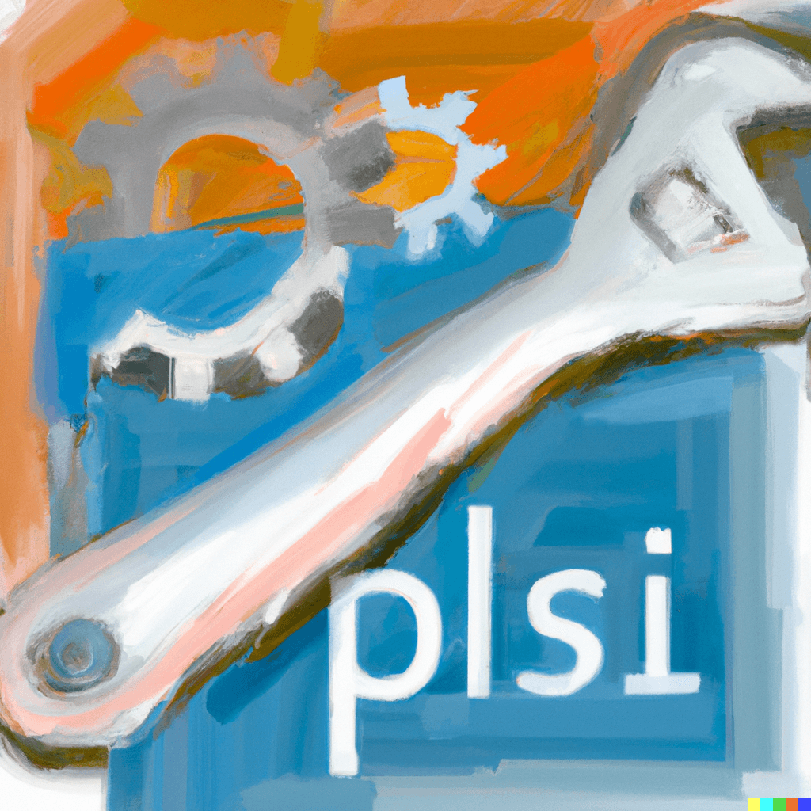

# cAPIsce
An Open-Source API Testing Tool

## About
capisce is an easy-to-use testing platform for APIs built with Python and Flask.

## Features
* Make GET, HEAD, POST, PUT, DELETE, OPTIONS and PATCH requests
* Display response/request data
* Create previews for response body with content types such as text, image, video, audio, etc.
* See your history of requests
* Switch between requests from the history and show up their data
* Download response body according to the associated MIME types

Check it out here:
* [GitHub](https://github.com/kaangiray26/capisce/)
* [PyPI](https://pypi.org/project/capisce/)