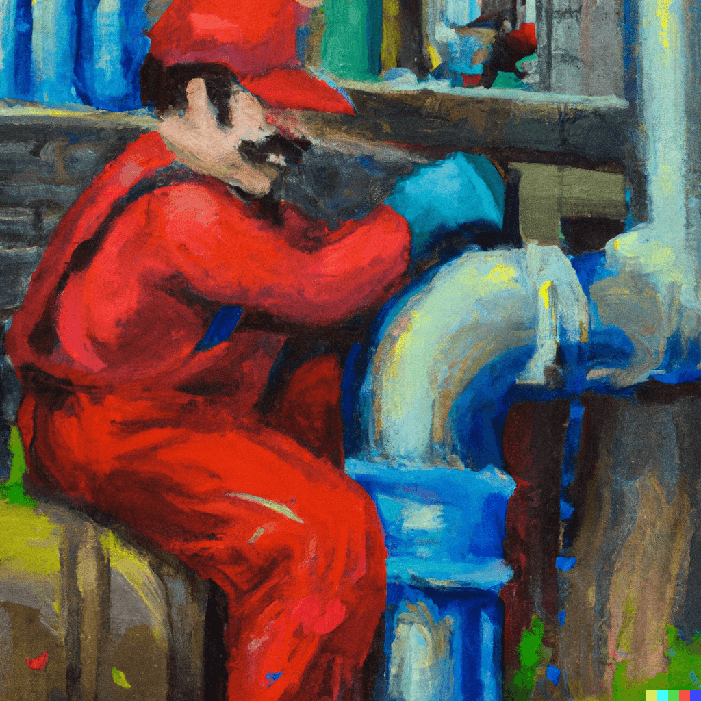

# RedDown
Client-side Reddit Media Downloader

## About
This is a simple web app that allows you to download media from Reddit without having to use a third-party website or app. It is built with Vue.js and uses the Reddit API to fetch the media.

Check it out here:
* [GitHub](https://github.com/kaangiray26/reddown)
* [F-Droid](https://red.buzl.uk)